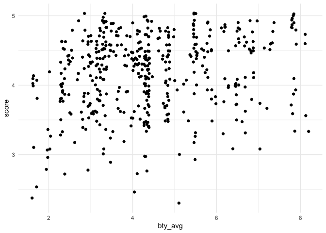

Lab 10 - Grading the professor, Pt. 1
================
Noah Booker
4/5/25

## Load Packages and Data

``` r
library(tidyverse) 
library(tidymodels)
library(openintro)
```

# Part 1: Exploratory Data Analysis

## Exercise 1

Visualize the distribution of score. Is the distribution skewed? What
does that tell you about how students rate courses? Is this what you
expected to see? Why, or why not? Include any summary statistics and
visualizations you use in your response.

``` r
evals %>% 
  ggplot(aes(x = score)) +
  geom_histogram() +
  theme_minimal()
```

    ## `stat_bin()` using `bins = 30`. Pick better value with `binwidth`.

<!-- -->

The histogram above reveals that the there is a negative skew in the
distribution of avaergae professor evaluation scores.

This reflects the fact that most student evaluations are towards the
more postive end of the scale, and few are negative.

This aligns with what I might’ve guessed. I would guess that it’s pretty
rare that teachers get very low evaluations.

## Exercise 2

Create a scatterplot of score versus bty_avg (a professor’s average
beauty rating). Describe any pattern you observe—does there appear to be
a trend, clustering, or wide variation? Don’t overthink it; just
describe what you see.

``` r
evals %>% 
  ggplot(aes(x = bty_avg, y = score)) +
  geom_point() +
  theme_minimal()
```

<!-- -->

Scores have possible values of 1-5 and bty_avg has possible values of
1-10. There is a fairly high density of high scores (between 4 and 5)
across the range of avearge beauty scores. However, in the lower range
of beauty ratings (2-5), there is a fairly high density of medium
evaluation scores (between 3 and 4) and some scores below 3, while in
the higher range of beauty ratings (6 to 8 and above), there are only
evaluatoin scores above 3, and there seem to be a greater density of
scores above 4.

## Exercise 3

Recreate your scatterplot from Exercise 2, but use geom_jitter() instead
of geom_point(). What does jittering do, and why might it improve the
plot? Was anything misleading or hidden in the original version?

``` r
evals %>% 
  ggplot(aes(x = bty_avg, y = score)) +
  geom_jitter() +
  theme_minimal()
```

<!-- -->

Jittering reveals the points that were laying on top of each other in
the original plot, showing the spots of the plot where there are a
greater density of points than we would have seen otherwise. My
interpretation of the patterns of the plot, however, is basically the
same.

# Part 2: Linear regression with a numerical predictor

## Hint

For Exercise 12, the `relevel()` function can be helpful!
