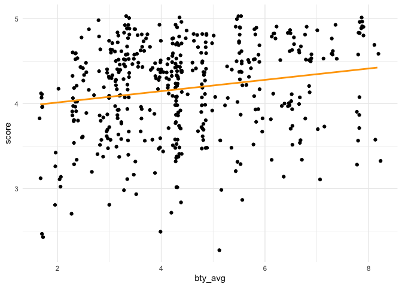

Lab 10 - Grading the professor, Pt. 1
================
Noah Booker
4/5/25

## Load Packages and Data

``` r
library(tidyverse) 
library(tidymodels)
library(openintro)
```

# Part 1: Exploratory Data Analysis

## Exercise 1

> Visualize the distribution of score. Is the distribution skewed? What
> does that tell you about how students rate courses? Is this what you
> expected to see? Why, or why not? Include any summary statistics and
> visualizations you use in your response.

``` r
evals %>% 
  ggplot(aes(x = score)) +
  geom_histogram() +
  theme_minimal()
```

    ## `stat_bin()` using `bins = 30`. Pick better value with `binwidth`.

<!-- -->

The histogram above reveals that the there is a negative skew in the
distribution of avaergae professor evaluation scores.

This reflects the fact that most student evaluations are towards the
more postive end of the scale, and few are negative.

This aligns with what I might’ve guessed. I would guess that it’s pretty
rare that teachers get very low evaluations.

## Exercise 2

> Create a scatterplot of score versus bty_avg (a professor’s average
> beauty rating). Describe any pattern you observe—does there appear to
> be a trend, clustering, or wide variation? Don’t overthink it; just
> describe what you see.

``` r
evals %>% 
  ggplot(aes(x = bty_avg, y = score)) +
  geom_point() +
  theme_minimal()
```

<!-- -->

Scores have possible values of 1-5 and bty_avg has possible values of
1-10. There is a fairly high density of high scores (between 4 and 5)
across the range of avearge beauty scores. However, in the lower range
of beauty ratings (2-5), there is a fairly high density of medium
evaluation scores (between 3 and 4) and some scores below 3, while in
the higher range of beauty ratings (6 to 8 and above), there are only
evaluatoin scores above 3, and there seem to be a greater density of
scores above 4.

## Exercise 3

> Recreate your scatterplot from Exercise 2, but use geom_jitter()
> instead of geom_point(). What does jittering do, and why might it
> improve the plot? Was anything misleading or hidden in the original
> version?

``` r
evals %>% 
  ggplot(aes(x = bty_avg, y = score)) +
  geom_jitter() +
  theme_minimal()
```

<!-- -->

Jittering reveals the points that were laying on top of each other in
the original plot, showing the spots of the plot where there are a
greater density of points than we would have seen otherwise. My
interpretation of the patterns of the plot, however, is basically the
same.

# Part 2: Linear regression with a numerical predictor

## Exercise 4

> Let’s see if the apparent trend in the plot is something more than
> natural variation. Fit a linear model called m_bty to predict average
> professor evaluation score by average beauty rating (bty_avg). Based
> on the regression output, write the linear model.

``` r
m_bty <- summary(lm(score ~ bty_avg, data = evals))
m_bty
```

    ## 
    ## Call:
    ## lm(formula = score ~ bty_avg, data = evals)
    ## 
    ## Residuals:
    ##     Min      1Q  Median      3Q     Max 
    ## -1.9246 -0.3690  0.1420  0.3977  0.9309 
    ## 
    ## Coefficients:
    ##             Estimate Std. Error t value Pr(>|t|)    
    ## (Intercept)  3.88034    0.07614   50.96  < 2e-16 ***
    ## bty_avg      0.06664    0.01629    4.09 5.08e-05 ***
    ## ---
    ## Signif. codes:  0 '***' 0.001 '**' 0.01 '*' 0.05 '.' 0.1 ' ' 1
    ## 
    ## Residual standard error: 0.5348 on 461 degrees of freedom
    ## Multiple R-squared:  0.03502,    Adjusted R-squared:  0.03293 
    ## F-statistic: 16.73 on 1 and 461 DF,  p-value: 5.083e-05

``` r
linear_reg() %>%
  set_engine("lm") %>%
  fit(score ~ bty_avg, data = evals) %>%
  tidy()
```

    ## # A tibble: 2 × 5
    ##   term        estimate std.error statistic   p.value
    ##   <chr>          <dbl>     <dbl>     <dbl>     <dbl>
    ## 1 (Intercept)   3.88      0.0761     51.0  1.56e-191
    ## 2 bty_avg       0.0666    0.0163      4.09 5.08e-  5

Based on the results of the regression analysis the model predicting
average professor evulation scores from average beauty rating is:

score_predicted = 3.89 + .07 x bty_avg + error

## Exercise 5

> Replot your visualization from Exercise 3, this time add a regression
> line in orange. Turn off the default shading around the line. By
> default, the plot includes shading around the line—what does that
> shading represent? And speculate why I’m asking you to turn it off.

``` r
evals %>% 
  ggplot(aes(x = bty_avg, y = score)) +
  geom_jitter() +
  geom_smooth(method = "lm", se = FALSE, color = "orange") +
  theme_minimal()
```

    ## `geom_smooth()` using formula = 'y ~ x'

<!-- -->

The default shading around the line represents the 95% confidence
interval, I think. I don’t know why you’re asking us to turn it off—it
seems like good information to have in the plot. Perhaps, it’s so that
we know how to turn it off, should we want to in the future.

## Exercise 6

> What does the slope of the model tell you? Interpret it in the context
> of this data—what does it say about how evaluation scores change with
> beauty ratings?

The slope of .07 indicates that, in the model, every 1-unit increase in
average beauty rating is associated with a .07 increase in average
professor evaluation score.

## Exercise 7

> What does the intercept represent in this model? Is it meaningful in
> this context, or just a mathematical artifact? Explain your reasoning.

The intercept in this model, 3.89, represents the predicted average
professor evaluation score for a professor with an average beauty rating
of 0. It’s meaningfulness in this context is limited by the fact that
there are no professors with an average beauty rating of 0 and by the
fact that we may not be interested in the predicted average professor
evaluation score for a professor with an average beauty rating of 0. If
we mean-centered the average beaty scores, then the intercept would
represent the professor evaluation score for a professor with the mean
beauty rating, which would be more interesting to know.

## Exercise 8

> What is the Rsquared value of this model? Interpret it in context: how
> much of the variation in evaluation scores is explained by beauty
> ratings?

The adjusted Rsquared in this model is .03. It indicates that beauty
ratings explain 3% of variation in evaluation scores.

# Part 3: Linear regression with a categorical predictor

> Let’s switch gears from numeric predictors to categorical ones. Beauty
> scores might be (somewhat) continuous, but characteristics like gender
> and rank are categorical, meaning they fall into distinct groups.

> We’ll start by seeing whether evaluation scores differ by gender.

``` r
m_gen <- lm(score ~ gender, data = evals)
tidy(m_gen)
```

    ## # A tibble: 2 × 5
    ##   term        estimate std.error statistic p.value
    ##   <chr>          <dbl>     <dbl>     <dbl>   <dbl>
    ## 1 (Intercept)    4.09     0.0387    106.   0      
    ## 2 gendermale     0.142    0.0508      2.78 0.00558

``` r
summary(m_gen)
```

    ## 
    ## Call:
    ## lm(formula = score ~ gender, data = evals)
    ## 
    ## Residuals:
    ##      Min       1Q   Median       3Q      Max 
    ## -1.83433 -0.36357  0.06567  0.40718  0.90718 
    ## 
    ## Coefficients:
    ##             Estimate Std. Error t value Pr(>|t|)    
    ## (Intercept)  4.09282    0.03867 105.852  < 2e-16 ***
    ## gendermale   0.14151    0.05082   2.784  0.00558 ** 
    ## ---
    ## Signif. codes:  0 '***' 0.001 '**' 0.01 '*' 0.05 '.' 0.1 ' ' 1
    ## 
    ## Residual standard error: 0.5399 on 461 degrees of freedom
    ## Multiple R-squared:  0.01654,    Adjusted R-squared:  0.01441 
    ## F-statistic: 7.753 on 1 and 461 DF,  p-value: 0.005583

## Exercise 9

> Take a look at the model output. What’s the reference level? What do
> the coefficients tell you about how evaluation scores differ between
> male and female professors?

R automatically created a dummy variable called gendermale in which
female is the reference category, and the coefficient indicates the
association of being male (versus female) on evaluation score. The
coefficient indicates that, in the model, male professors have
evaluation scores .14 points higher than female professors on average.

## Exercise 10

> What is the equation of the line corresponding to male professors?
> What is it for female professors?

male professors: score_predicted = 4.09 + .14 x gendermale + error
female professors: score_predicted = 4.23 + -.14 x genderfemale + error

## Exercise 11

> Fit a new linear model called m_rank to predict average professor
> evaluation score based on rank of the professor. Based on the
> regression output, write the linear model and interpret the slopes and
> intercept in context of the data.

``` r
m_rank <- lm(score ~ rank, data = evals)
summary(m_rank)
```

    ## 
    ## Call:
    ## lm(formula = score ~ rank, data = evals)
    ## 
    ## Residuals:
    ##     Min      1Q  Median      3Q     Max 
    ## -1.8546 -0.3391  0.1157  0.4305  0.8609 
    ## 
    ## Coefficients:
    ##                  Estimate Std. Error t value Pr(>|t|)    
    ## (Intercept)       4.28431    0.05365  79.853   <2e-16 ***
    ## ranktenure track -0.12968    0.07482  -1.733   0.0837 .  
    ## ranktenured      -0.14518    0.06355  -2.284   0.0228 *  
    ## ---
    ## Signif. codes:  0 '***' 0.001 '**' 0.01 '*' 0.05 '.' 0.1 ' ' 1
    ## 
    ## Residual standard error: 0.5419 on 460 degrees of freedom
    ## Multiple R-squared:  0.01163,    Adjusted R-squared:  0.007332 
    ## F-statistic: 2.706 on 2 and 460 DF,  p-value: 0.06786

``` r
contrasts(evals$rank)
```

    ##              tenure track tenured
    ## teaching                0       0
    ## tenure track            1       0
    ## tenured                 0       1

score_predicted = 4.28 + -0.13 x rank_tenure_track + -0.15 x
rank_tenured

Because teaching professors are the reference category, the intercept of
the model, 4.28, represents the average evaluations score for teaching
professors. The slopes indicate that tenure track professors, on
average, get evaluation scores .13 points lower than teaching professors
and that tenured professors, on average, get evaluation scores .15
points lower than teaching professors.

## Exercise 12

> Create a new variable called rank_relevel where “tenure track” is the
> baseline level. Hint: The `relevel()` function can be helpful!

``` r
evals <- evals %>%
  mutate(rank_relevel = relevel(rank, ref = "tenure track")) #Claude helped.
contrasts(evals$rank_relevel)
```

    ##              teaching tenured
    ## tenure track        0       0
    ## teaching            1       0
    ## tenured             0       1
